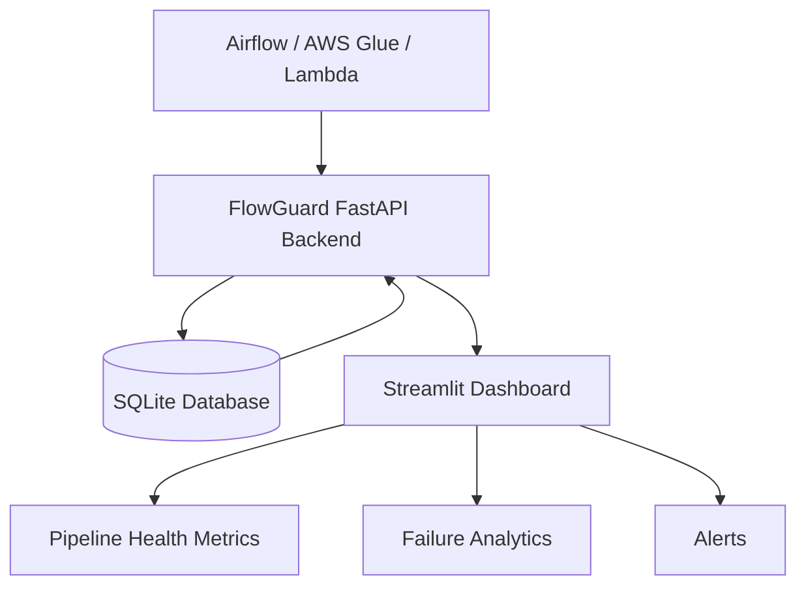
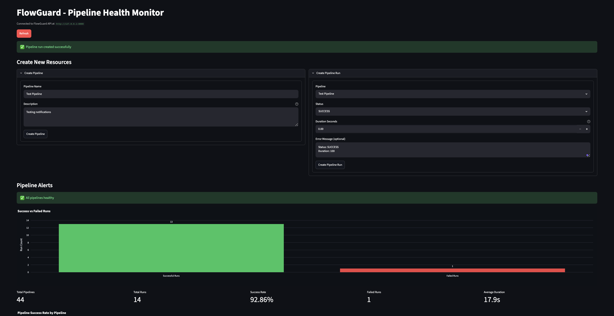
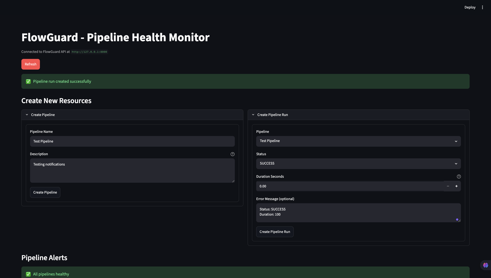
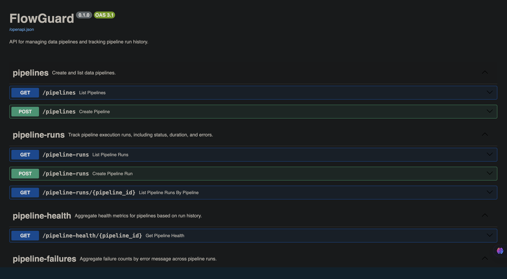

# FlowGuard

FlowGuard is a Data Pipeline Health Monitoring Platform built using FastAPI, Streamlit, SQLite, and Plotly.

It helps Data Engineers monitor pipeline executions, track failures, analyze pipeline health, and visualize operational metrics through an interactive dashboard.

---

## Features

### Pipeline Management
- Create pipelines
- View registered pipelines

### Pipeline Run Tracking
- Track SUCCESS and FAILED runs
- Store execution duration
- Capture error messages

### Pipeline Health Monitoring
- Success Rate
- Total Runs
- Failed Runs
- Average Runtime

### Failure Analytics
- Error categorization
- Failure distribution charts
- Failure trend visibility

### Alerts
- Create alerts
- View alerts
- Pipeline risk visibility

### Dashboard
- Interactive Streamlit dashboard
- Plotly visualizations
- Health overview tables

---

## Architecture


<!-- ```text
┌─────────────┐
│ Streamlit   │
│ Dashboard   │
└──────┬──────┘
       │
       ▼
┌─────────────┐
│ FastAPI     │
│ Backend API │
└──────┬──────┘
       │
       ▼
┌─────────────┐
│ SQLite DB   │
└─────────────┘
``` -->

---

## Tech Stack

### Backend
- FastAPI
- SQLAlchemy
- SQLite

### Frontend
- Streamlit
- Plotly
- Pandas

### Testing
- Pytest

---

## Screenshots

### Dashboard



### Create Pipeline



### Swagger API Documentation



---

## API Endpoints

### Pipelines

- GET /pipelines
- POST /pipelines

### Pipeline Runs

- GET /pipeline-runs
- POST /pipeline-runs

### Pipeline Health

- GET /pipeline-health/{pipeline_id}

### Failure Analytics

- GET /pipeline-failures

### Alerts

- GET /alerts
- POST /alerts

---

## Local Setup

### Clone Repository

```bash
git clone https://github.com/vaibhav-5-7/FlowGuard.git

cd FlowGuard
```

### Create Virtual Environment

```bash
python3 -m venv .venv

source .venv/bin/activate
```

### Install Dependencies

```bash
pip install -r requirements.txt
```

---

## Run Backend

```bash
uvicorn app.main:app --reload
```

Backend URL:

```text
http://127.0.0.1:8000
```

Swagger:

```text
http://127.0.0.1:8000/docs
```

---

## Run Frontend

```bash
streamlit run frontend/streamlit_app.py
```

---

## Future Enhancements

- AWS Glue Integration
- Airflow Integration
- Databricks Integration
- Docker Support
- Cloud Deployment
- Automatic Alert Generation

---

## Author

Vaibhav B. Pande

Data Engineering Enthusiast